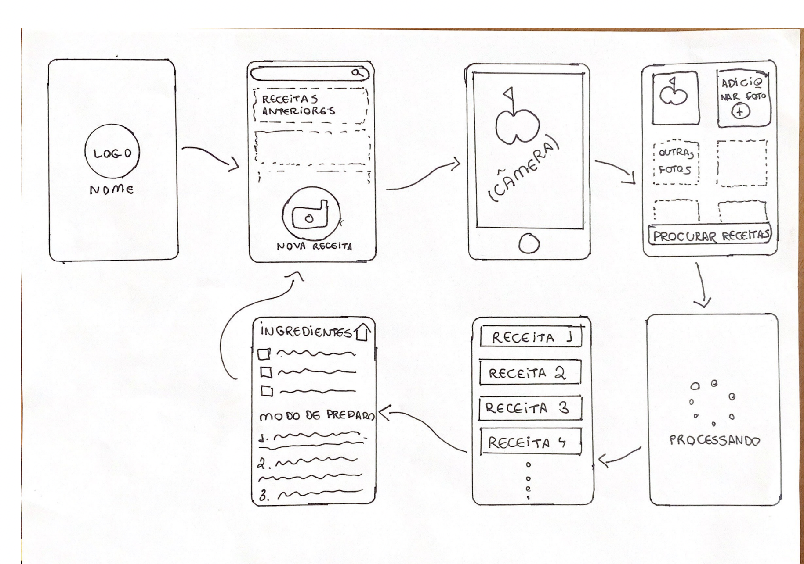

## Visão Geral
Protótipos de baixa fidelidade são representações simples e rápidas de um app, geralmente feitos em papel ou com wireframes básicos, focando na estrutura e navegação. Já os de alta fidelidade são mais detalhados, incluindo cores, fontes e interações próximas do produto final. Ambos ajudam a validar ideias e melhorar a experiência do usuário antes do desenvolvimento.

## Protótipo de Baixa Fidelidade

**Autor:** Yasmin Dayrell Albuquerque e João Marcelo Guimarães Costa Naves

### Fluxo Básico
- O Usuário Loga na Aplicação
- Na tela principal possui dois fluxos:
    - Ver receitas salvas e pesquisadas anteriormente
    - Acessar a Camera para tirar foto de um ingrediente (Nova Receita)

### Fluxo Foto do Ingrediente
- O Usuário tira a foto de um ingrediente
- O Usuário pode tirar foto de outros ingredientes
- Após fotos tiradas, clica-se na opção para pesquisar receitas
- O Aplicativo faz o processamento das imagens e busca as receitas

### Fluxo Receitas
- O aplicativo mostra as receitas que são feitas preparadas com os ingredientes selecionados pelo Usuário
- O Usuário acessa a receita desejada
- É mostrado o passo a passo para se realizar a receita (Ingredientes e Modo de Preparo)
- O Usuário pode salvar uma ou mais receitas
- O Usuário volta para tela inicial

## Histórico de versões

| Versão | Alteração       | Responsável         | Data Alteração |
|--------|-----------------|---------------------|----------------|
| 1.0    | Criação do documento de protótipos e adição do protótipo de baixa fidelidade  | Diógenes Dantas Lélis Júnior | 06/05/2025 |

